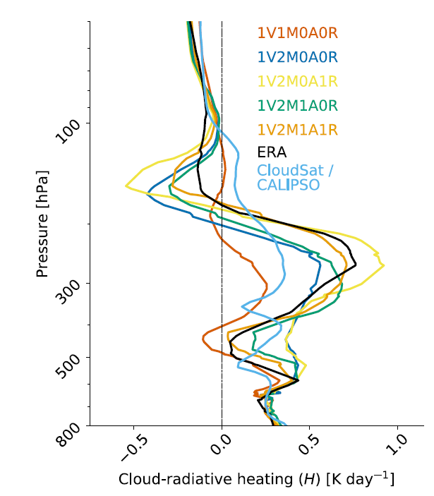
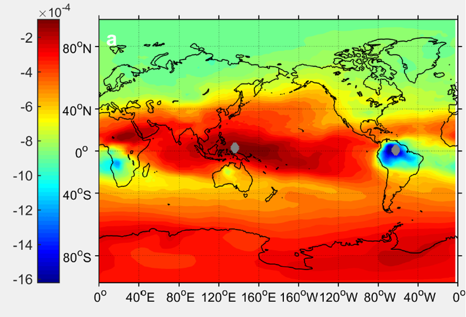

# Research

We are broadly interested in scale interactions in the atmosphere and how best to represent these in weather and climate models in order to build resilience in water-susceptible regions. At the moment, we are focused on mesoscale convective systems as a specific instance of this atmospheric scale problem. Mesoscale convective systems are aggregations of thunderstorms that extend over hundreds of kilometers and bring the majority of extreme rainfall throughout the tropics. Their intermediate size in the spectrum of atmospheric phenomena means that they are influenced by both the smallest scales (like ice crystal or droplet formation, called cloud microphysics) and the largest scales (via circulation patterns like the Hadley cell). We are working to understand the smallest scales through benchtop experimentation and idealized parcel modeling and the largest scales through high-resolution storm-resolving simulations. 

**We are hiring!** [A postdoc position](https://arizona.csod.com/ux/ats/careersite/4/home/requisition/8896?c=arizona) focused on setting up a laboratory space to perform benchtop experiments on small-scale ice physics. If you have interest in nucleation, crystallization, or cloud microphysics, please get in touch!

{:class="float-left"}{:height='300'}

## Radiative heating from ice clouds

In a series of storm-resolving (2.5-km) simulations over the Asian monsoon region, we found a strong effect of ice microphysical ``switches" (factors like ice crystal size and whether the model tracks crystal number along with ice mass) on the cloud-radiative heating rates and outgoing longwave radiation. We wrote a blog post for Nature Communities about the study [here](https://sustainabilitycommunity.springernature.com/posts/how-ice-crystals-heat-the-atmosphere?channel_id=behind-the-paper), and the Karlsruhe Institute of Technology and University of Vienna wrote press releases [here](https://www.kit.edu/kit/29383.php) and [here](https://fgga.univie.ac.at/forschung/forschungsportal-detailansicht/news/wie-eiswolken-die-atmosphaere-aufheizen/?tx_news_pi1%5bcontroller%5d=News&tx_news_pi1%5baction%5d=detail&cHash=591b989b86849d39d4966129bd475560). We are currently finishing up work that uses a trajecotry module to track the ice cloud outflow from convective storms over time.

**Publications**

S. C. Sullivan, A. Voigt, A. Miltenberger, C. Rolf, and M. Krämer (2022). Constraining feedbacks to assess the impact of ice microphysics on cloud-radiative heating *[in preparation for J. Adv. Model Earth Sys.]*

S. C. Sullivan and A. Voigt (2021). **[Ice microphysical processes exert a strong control on the simulated radiative energy budget in the tropics](https://www.nature.com/articles/s43247-021-00206-7#MOESM1)** *Comm. Earth & Env.* 2 (137) doi: 10.1038/s43247-021-00206-7.

## Satellite climatologies of mesoscale convective systems

ISCCP convective tracking data between 1983 and 2008 was collocated with a precipitation product (MSWEP) and synoptic conditions (ERA-Interim). From these datasets, we generated climatologies of organized convective structure, their associated precipitation, and environmental conditions in the warm and cold phases of El Niño (<a href="/codes-and-slides">MCS collocation scripts</a>). We used simple information entropy metrics to quantify proximity of convective occurrence (<a href="/codes-and-slides">Entropy algorithm</a>) and most recently used the surface energy and vertical momentum budgets to explain warm-cold phase differences in the distribution of precipitation intensities.

**Publications**

S. Chakraborty, S. C. Sullivan, and Z. Feng (2022). An Overview of Mesoscale Convective Systems: Global Climatology, Satellite Observations, and Modelling Strategies. Under review at *Geophys. Monog. Series*.

S. C. Sullivan, K. A. Schiro, J. Yin, and P. Gentine (2020). **[Change in tropical precipitation intensity with El Niño warming](https://agupubs.onlinelibrary.wiley.com/doi/10.1029/2020GL087663)** *Geophys. Res. Lett.* 47 (14) e2020GL087663.

K. A. Schiro, S. C. Sullivan, Y.-H. Kuo, H. Su, P. Gentine, G. S. Elsaesser, J. H. Jiang, and J. David Neelin (2020). **[Environmental controls on tropical mesoscale convective system precipitation intensity](https://journals.ametsoc.org/jas/article/doi/10.1175/JAS-D-20-0111.1/354632/Environmental-controls-on-tropical-mesoscale)** *J. Atmos. Sci.* doi: 10.1175/JAS-D-20-0111.1

S. C. Sullivan, K. A. Schiro, C. A. Stubenrauch, and P. Gentine (2019). **[The response of tropical organized convection to El Niño Warming](https://agupubs.onlinelibrary.wiley.com/doi/abs/10.1029/2019JD031026)** *J. Geophys. Res.* 124 (15) pp. 8481--8500.

## Parcel and mesoscale modeling of secondary ice production

I built a mixed-phase microphysics parcel model to describe secondary ice production processes like collisional breakup and rime splintering (<a href="/codes-and-slides">SIM codes</a>). With this idealized model, I generated estimates of the ice crystal number enhancement from secondary processes, as well as the impact of hydrometeor non-sphericity and updraft fluctuations. I later developed more sophisticated parameterizations of these processes for the COSMO metoeorological model of the German Weather Service and contributed to a review article on observations and modeling of these secondary processes.

**Publications**

G. Sotiropoulou, S. C. Sullivan, J. Savre, G. Lloyd, T. Lachlan-Cope, A. Ekman, and A. Nenes (2020). **[The impact of secondary ice production on Arctic stratocumulus](https://www.atmos-chem-phys.net/20/1301/2020/)**. *Atmos. Chem. Phys.* 20 pp. 1301-1316. 

S. C. Sullivan, C. Barthlott, J. Crosier, I. Zhukov, A. Nenes, and C. Hoose (2018). **[The effect of secondary ice production parameterization on the simulation of a cold frontal rainband](https://www.atmos-chem-phys.net/18/16461/2018/acp-18-16461-2018.pdf)** *Atmos. Chem. Phys.* 18 pp. 16461--16480.

S. C. Sullivan, C. Hoose, A. Kiselev, T. Leisner, and A. Nenes (2018). **[Initiation of secondary ice production in clouds](https://www.atmos-chem-phys.net/18/1593/2018/acp-18-1593-2018.pdf)** *Atmos. Chem. Phys.* 18 pp. 1593--1610.

P. R. Field et al. (2017). **[Secondary ice production: Current state of the science and recommendations for the future](https://journals.ametsoc.org/mono/article/doi/10.1175/AMSMONOGRAPHS-D-16-0014.1/28239/Secondary-Ice-Production-Current-State-of-the)** *Meteor. Monogr.* 58: 7.1-7.20.

S. C. Sullivan, C. Hoose, and A. Nenes (2017). **[Investigating the contribution of secondary ice production to in‐cloud ice crystal numbers](https://agupubs.onlinelibrary.wiley.com/doi/full/10.1002/2017JD026546)** *J. Geophys. Res.* 122 (17) pp. 9391--9412.

{:class="float-left"}{:height='300'}

## Sensitivity and attribution analyses for ice nucleation

Computationally efficient sensitivity and attribution analyses can be performed with automatic differentiation of parameterization codes in large-scale models. The resultant *adjoint model* obviates the need for finite differencing, as an output perturbation is back-propagated through to various input perturbations. I have built adjoints from the ice nucleation codes in the Community Atmosphere Model and the Goddard Earth-Observing model and used these to indentify nucleation regime shifts, quantify aerosol nucleation efficiencies, and define temporal attribution metrics.

**Publications**

S. Bacer, S. Sullivan, H. Tost, J. Lelieveld, and A. Pozzer (2021). **[Cold cloud microphysical process rates in a global chemistry-climate model](https://acp.copernicus.org/articles/21/1485/2021/acp-21-1485-2021.pdf)** *Atmos. Chem. Phys.* 21 pp. 1485–1505.

S. Bacer, S. Sullivan, V. A. Karydis, D. Barahona, A. Nenes, H. Tost, A. P. Tsimpidi, J. Lelieveld, and A. Pozzer (2018). **[Implementation of a comprehensive ice crystal formation parameterization into the EMAC model](https://www.geosci-model-dev.net/11/4021/2018/)** *Geosci. Model Devel.* 11 pp. 4021--4041.

S. C. Sullivan, D. Lee, L. Oreopoulos, and A. Nenes (2016). **[Role of updraft velocity in temporal variability of global cloud hydrometeor number](https://www.pnas.org/content/113/21/5791)** *Proc. Nat. Acad. Sci.* 113 (21) pp. 5791--5796.

S. C. Sullivan, R. Morales, D. Barahona, and A. Nenes (2016). **[Understanding cirrus ice crystal number variability for different heterogeneous ice nucleation spectra](https://www.atmos-chem-phys.net/16/2611/2016/acp-16-2611-2016.pdf)** *Atmos. Chem. Phys.* 16 pp.2611--2629.

B. A. Sheyko, S. C. Sullivan, R. Morales, S. L. Capps, D. Barahona, X. Shi., X. Liu, and A. Nenes (2015). **[Quantifying sensitivities of ice crystal number and sources of ice crystal number variability in CAM 5.1 using the adjoint of a physically based cirrus formation parameterization](https://agupubs.onlinelibrary.wiley.com/doi/full/10.1002/2014JD022457)** *J. Geophys. Res.* 120 (7) pp. 2834--2854.
