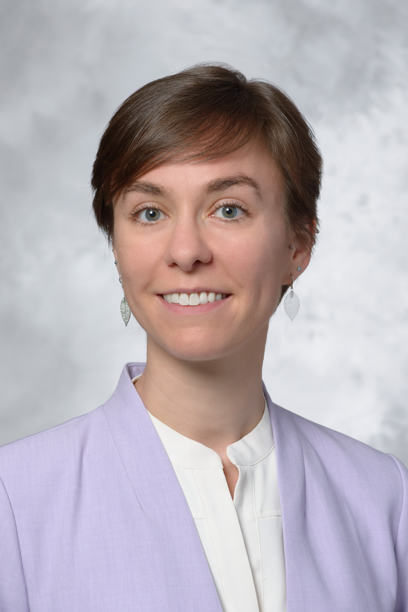
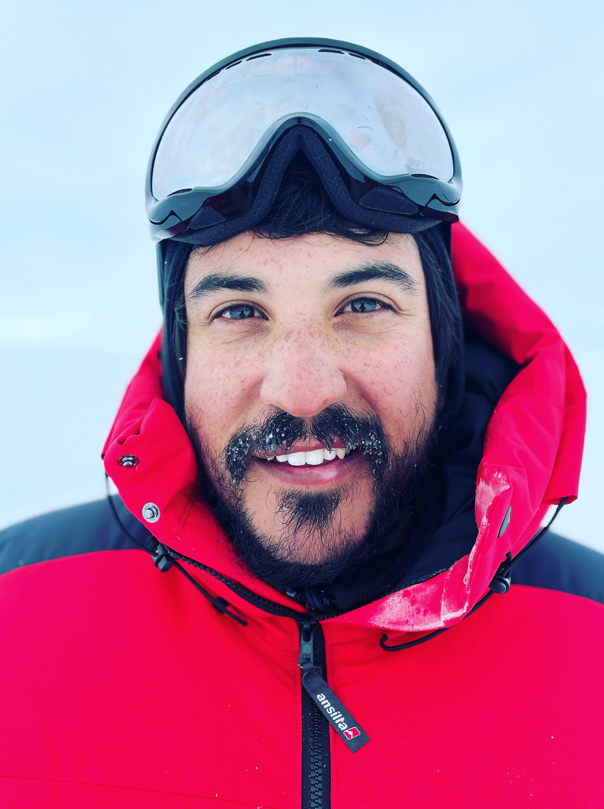

{:class="float-left"}{:height='300'}

**Principal Investigator - Sylvia Sullivan**

Sylvia is an Assistant Professor at the University of Arizona since January 2022. She has spent time as a fellow at the Karlsruhe Institute of Technology and a postdoctoral researcher at Columbia University. She earned her doctorate from the Georgia Institute of Technology in 2017 and her bachelors from the California Institute of Technology in 2012, both in chemical engineering with concentrations on earth and environmental sciences. In her free time, she is an avid runner, reader, and language buff.

**[Sylvia's CV](/Files/CV-SSullivan.pdf)**

{:class="float-left"}{:height='300'}

**Doctoral Student - Thabo Makgoale**

Thabo is a PhD student in Hydrology & Atmospheric Sciences, focusing on the effect of ice microphysics within tropical mesoscale convective systems using storm-resolving simulations. Mr. Makgoale has been working as a research scientist in Climate Change and Variability for almost 7 years at the South African Weather Services (SAWS). He completed his Bachelors degree in Ocean and Atmospheric Sciences in 2012 and his honours degree in Atmospheric Sciences in 2013, both from the University of Cape Town through the Climate System Analysis Group (CSAG). He completed his Masters degree in Geography and Environmental Management at North-West University (NWU) in 2021 with a thesis investigating the sensitivity of simulated temperatures in climate models to aerosols over southern Africa.

{:class="float-left"}{:height='300'}

**Doctoral Student - Edgardo Sepúlveda Araya**

Edgardo is a PhD student in Environmental Engineering, focusing on the radiative effect of cloud ice optics schemes in storm-resolving simulations. He has been working as an Associate Researcher in the Antarctic Research Group in the Department of Physics at the University of Santiago of Chile with interest in climate change impacts in Chile and Antarctica. He received his Bachelors in Applied Physics in 2015 and his Diplom in Physics Engineering in 2021, both from the University of Santiago of Chile. Over the last 6 years, Edgardo has been involved in a series of field campaigns from the Atacama Desert in northern Chile to Union Glacier in Antarctica, with studies focused mainly on UV radiation, the Antarctic ozone hole and radiative effects of clouds on the Antarctic Peninsula. Edgardo spends most of his free time playing music and listening to different styles of music, jazz being one of his favorites.
